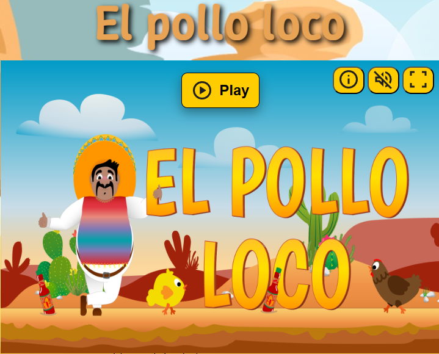
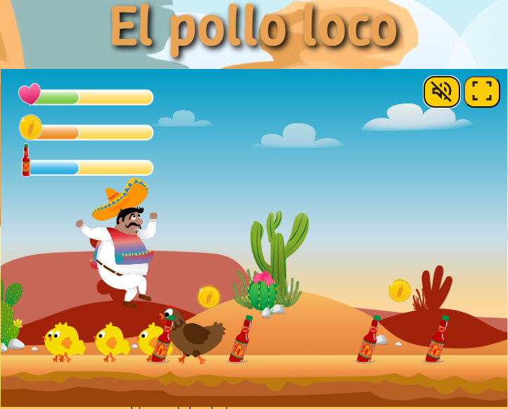

# El Pollo Loco

**El Pollo Loco** is my first 2D action-adventure game. In this game, you control a brave character who fights against various chickens. The game is suitable for all ages and offers fun and challenging gameplay elements.



## 🌟 Features

- **Characters and Enemies**: You control your character to defeat enemies and collect various items.
- **Puzzles and Boss Fights**: A thrilling boss fight awaits you.
- **Sound Effects**: Music and sound effects create an immersive gaming experience.

## 🏆 Gameplay Mechanics

- The character can move in all directions, jump, and attack.
- There are different types of enemies, such as normal chickens and the final boss, each with their own attack strategies.
- In the game, you can find bottles and collect coins.
- Your goal is to defeat the final boss and win the game.

## 🎮 Controls

- W: JUMP
- D: RIGHT
- A: LEFT
- E: THROW



## ⚙️ Installation

### Prerequisites

- **Web Browser**: The game runs directly in a web browser, so no installation is required. It uses HTML, CSS, and JavaScript to run the game.

### Running Locally

1. **Clone this repository**:

    ```bash
    git clone https://github.com/DEIN-GITHUB-BENUTZERNAME/el-pollo-loco.git
    ```

2. **Execute index.html**:
    ```bash
    cd EL_POLLO_LOCO
    double click or press enter to execute index.html
    ```

## 🎉 I wish you a lot of fun with the game

## 📞 Contact

- GitHub: [Faragas91](https://github.com/Faragas91)
- Email: stefanredl@gmx.at
- LinkedIn: [Stefan Redl](www.linkedin.com/in/stefanredl)
